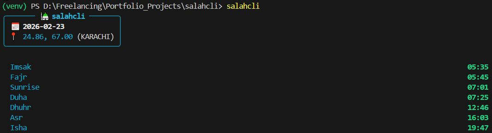
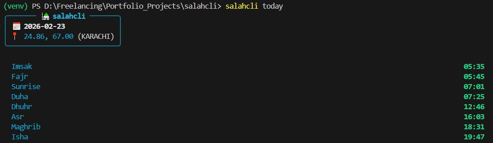

# salahcli

`salahcli` is a lightweight, offline-first command-line tool for Islamic prayer times. Powered by real astronomical calculations.

Designed for developers, terminal users, and privacy-conscious Muslims. No cloud services. No accounts. No tracking.

---

## Features

- **Offline Calculation**: All prayer times are computed locally after initial setup. No external APIs needed.
- **High Accuracy**: Uses true astronomical solar calculations, not online prayer-time lookups.
- **High Latitude Support**: Correct handling of extreme northern and southern regions.
- **Minimal Dependencies**: Core engine uses only the Python standard library. The optional UI layer uses `rich`.
- **Privacy Friendly**: Zero tracking, zero accounts, zero remote services.
- **Clean Terminal UI**: Beautiful, readable output for modern terminals.

---

## Installation

Install with **pipx** (recommended) for global access in an isolated environment:

```bash
pipx install .
```

Or install directly with pip:

```bash
pip install .
```

---

## Quick Demo



```
$ salahcli

🕌 salahcli
📅 2026-02-23   📍 33.66, 73.04   (MWL)

  Imsak      05:12
  Fajr       05:22
  Sunrise    06:45
  Duha       07:11
  Dhuhr      12:22
  Asr        15:32
  Maghrib    17:58
  Isha       19:17
```

---

## Usage

### 1. Initialize Configuration

Detect your location via IP (used only once) and save a local config:

```bash
salahcli init
```

Configuration is stored at `~/.salahcli/config.json`.

### 2. Today's Prayer Times

Display today's full prayer schedule:

```bash
salahcli today
```



### 3. Next Prayer Countdown

Show the upcoming prayer and how long until it begins:

```bash
salahcli next
```


**Example output:**

```
🕌 Next Prayer: Maghrib
⏳ Starts in:   01h 12m
```

---

## Calculation Methods

`salahcli` supports widely used global calculation standards. Change your method in `~/.salahcli/config.json`.

| Key         | Organization                                              |
|-------------|-----------------------------------------------------------|
| `MWL`       | Muslim World League                                       |
| `ISNA`      | Islamic Society of North America                          |
| `EGYPT`     | Egyptian General Authority of Survey                      |
| `MAKKAH`    | Umm Al-Qura University, Makkah                            |
| `KARACHI`   | University of Islamic Sciences, Karachi                   |
| `TEHRAN`    | Institute of Geophysics, University of Tehran             |
| `JAFARI`    | Shia Ithna-Ashari                                         |
| `GULF`      | Gulf Region                                               |
| `KUWAIT`    | Kuwait                                                    |
| `QATAR`     | Qatar                                                     |
| `SINGAPORE` | Majlis Ugama Islam Singapura (MUIS)                       |
| `FRANCE`    | Union des Organisations Islamiques de France (UOIF)       |
| `TURKEY`    | Diyanet İşleri Başkanlığı (Turkey)                        |
| `RUSSIA`    | Spiritual Administration of Muslims of Russia             |
| `DUBAI`     | Dubai Islamic Affairs & Charitable Activities Department  |
| `JAKIM`     | Jabatan Kemajuan Islam Malaysia (JAKIM)                   |
| `TUNISIA`   | Tunisia                                                   |
| `ALGERIA`   | Algeria                                                   |
| `INDONESIA` | Kementerian Agama Republik Indonesia                      |
| `MOROCCO`   | Morocco                                                   |
| `PORTUGAL`  | Portugal                                                  |
| `JORDAN`    | Jordan Ministry of Awqaf & Islamic Affairs                |
---

## Configuration

The config file lives at `~/.salahcli/config.json` and supports:

- **Latitude / Longitude**: Set manually or auto-detected on `init`
- **Calculation Method**: Choose from the methods listed above
- **Madhab**: Affects Asr calculation (Shafi/Hanafi)
- **Time Format**: 12-hour or 24-hour

---

## Philosophy

Prayer times should be accurate, private, and available offline directly from your terminal.

---

## Author

**Hassan Khan**  
*AI Engineer & Developer*

� [hassanaiengineer@gmail.com](mailto:hassanaiengineer@gmail.com)  
🔗 [LinkedIn](https://www.linkedin.com/in/hassan-khan-4961b722b/)

---

## License

This project is licensed under the [MIT License](LICENSE).